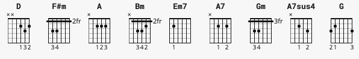

# Across the Universe



```
D    Bm   F#m
Em7  A    A7
D    Bm   F#m
Em7  Gm
```
Words are flowing out like endless rain into a paper cup\
They slither wildly as they slip away across the universe\
Pools of sorrow, waves of joy are drifting through my opened mind\
Possessing and caressing me

```
D    A7sus4
A    A7
G    D
A    A7
G    D
```

Jai guru deva om
Nothing's gonna change my world\
Nothing's gonna change my world\
Nothing's gonna change my world\
Nothing's gonna change my world
 
```
D    Bm   F#m  
Em7  A    A7
D    Bm   F#m
Em7  A    A7
```
Images of broken light which dance before me like a million eyes\
They call me on and on across the universe\
Thoughts meander like a restless wind inside a letterbox\
They tumble blindly as they make their way across the universe